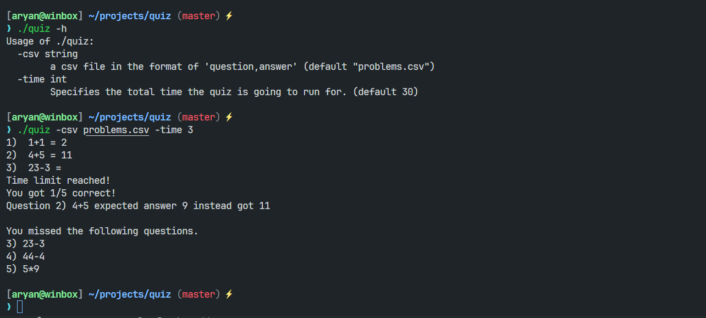

# Quiz
A quiz system implemented in go.

# TODO
- [ ] Add support for setting timers 
- [ ] Migrate to cobra instead of flags for arguments
- [ ] Add support for per question time using tickers
- [ ] Add support for displaying individual time limit using profress bars ref (bubbles/bubbletea)
- [ ] Add support for different question formats
  - [ ] Migrate to JSON instead of csv for question format
  - [ ] Implement various acceptable question answer type schemas
  - [ ] Support for MCQ type questions
    - [ ] only one answer correct schema
    - [ ] Multiple correct answers schema
- [ ] Add support for reading configurations and question schemas from configuration files (ref spf13/viper)

# Working
